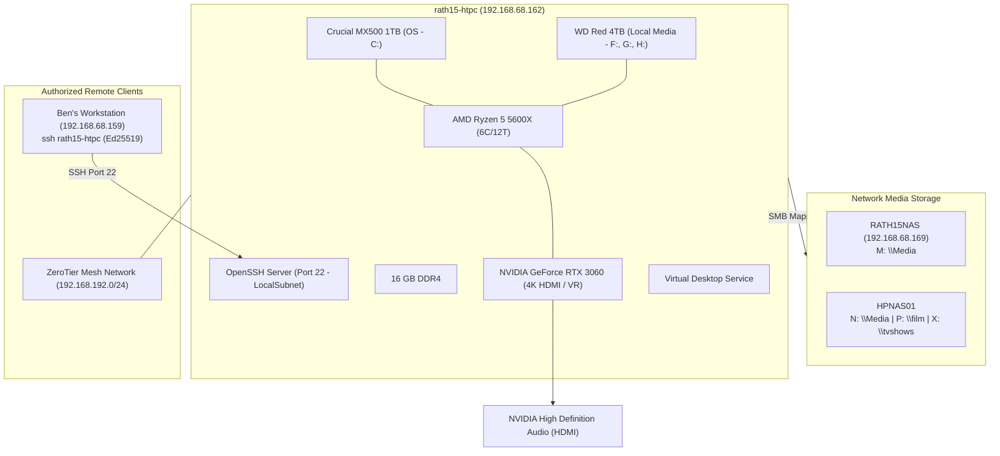

# rath15-htpc System Architecture Specification

## 1. Node Overview & System Purpose

`rath15-htpc` is a dedicated high-performance living room Home Theater PC (HTPC), media rendering node, and gaming workstation operating on the local home network. It provides 4K hardware-accelerated video decoding, multi-channel HDMI audio passthrough, VR streaming (via Virtual Desktop / Oculus), PC gaming (Steam, Epic Games), and network media ingestion from centralized network storage (`RATH15NAS` and legacy `HPNAS01`).



---

## 2. Hardware Architecture & Specifications

| Parameter | Specification | Details / Status |
| :--- | :--- | :--- |
| **Node Identity** | `RATH15-HTPC` | Local Workgroup Node |
| **Operating System** | Microsoft Windows 11 Pro (64-bit) | Build `10.0.26200` |
| **Processor** | AMD Ryzen 5 5600X 6-Core Processor | 6 Cores / 12 Threads (Zen 3) |
| **Motherboard** | MSI MAG B550 TOMAHAWK (MS-7C91) | AMD B550 Chipset, Dual PCIe / Dual M.2 |
| **System Memory** | 15.93 GB Total Physical RAM | **12.71 GB Free / 3.22 GB Active Working Set** (79.8% Available) |
| **System Uptime** | Healthy / Stable | 0 Kernel-Power 41 events; 0 WHEA hardware faults |

---

## 3. Graphics, Display & Audio Pipeline

As a dedicated media and gaming endpoint, `rath15-htpc` relies on a discrete NVIDIA GPU for display output and hardware decoding:

### 3.1. Video Controllers (GPUs)
* **Primary Discrete GPU:** `NVIDIA GeForce RTX 3060`
  * **Driver Version:** `32.0.15.9621`
  * **Resolution:** `3840 x 2160` (4K UHD) @ 32-bit true color
  * **Capabilities:** Hardware NVDEC / NVENC (AV1, HEVC, H.264), Ray Tracing, DLSS
* **Virtual Display Monitor:** `Virtual Desktop Monitor` (v15.39.56.845)
  * Mirrors / extends 4K display for wireless VR streaming to standalone headsets.

### 3.2. Audio Subsystems
* **HDMI Passthrough:** `NVIDIA High Definition Audio` (Direct digital bitstream / Atmos / DTS-HD to AV receiver or TV).
* **Motherboard Analog:** `Realtek High Definition Audio`.
* **Streaming & VR Audio:**
  * `Steam Streaming Speakers & Microphone`
  * `Oculus Virtual Audio Device`
  * `Virtual Desktop Audio`
  * `NVIDIA Virtual Audio Device (Wave Extensible)`

---

## 4. Storage Topology & Drive Mappings

The storage architecture is divided between high-speed local SATA SSD storage for the OS/apps, a large mechanical storage disk for bulk files, and multiple network mounts for media libraries.

### 4.1. Physical Disks
| Disk ID | Model | Media | Bus | Capacity | Health Status | Operational Status |
| :--- | :--- | :--- | :--- | :--- | :--- | :--- |
| **Disk 0** | `CT1000MX500SSD1` | SSD | SATA | 931.5 GB | **Healthy** | OK |
| **Disk 1** | `WDC WD40EFRX-68N32N0` | HDD | SATA | 3,726 GB (4TB) | **Healthy** | OK |

### 4.2. Local Logical Partitions
| Drive | Root | Total (GB) | Used (GB) | Free (GB) | % Free | Role / Description |
| :--- | :--- | :--- | :--- | :--- | :--- | :--- |
| **C:** | `C:\` | 930.6 GB | 451.5 GB | **479.1 GB** | **51.5%** | Windows 11 OS, Applications, Dedicated Paging File (`pagefile.sys`) |
| **D:** | `D:\` | 7.9 GB | 7.9 GB | **0.0 GB** | **0.0%** | Recovery / Reserved Image Partition |
| **F:** | `F:\` | 1,401.8 GB | 1,246.4 GB | **155.4 GB** | **11.1%** | Mechanical Partition 1 (Steam Library / Media; +63.4 GB gained via game purge) |
| **G:** | `G:\` | 957.0 GB | 658.2 GB | **298.8 GB** | **31.2%** | Mechanical Partition 2 (Steam Library / Downloads; +209.1 GB gained via orphaned duplicate purge) |
| **H:** | `H:\` | 1,367.2 GB | 994.6 GB | **372.6 GB** | **27.3%** | Mechanical Partition 3 (Steam Library / Archive Media; +272.0 GB gained via game uninstalls) |

### 4.3. Virtual Memory & Paging Topology
* **Dedicated SSD Paging:** Windows Virtual Memory (`PagingFiles`) is consolidated strictly onto high-speed Crucial MX500 SATA SSD storage (`C:\pagefile.sys 8000 16000`).
* **Mechanical Partition Paging Eliminated:** Mechanical swap files on `F:\`, `G:\`, and `H:\` were decommissioned and purged upon restart, permanently stopping 5,400 RPM mechanical head thrashing and reclaiming 24 GB (+50.0 GB total mechanical storage recovered).

### 4.4. Network SMB Mounts
| Drive Letter | Remote UNC Path | Target Host | Purpose |
| :--- | :--- | :--- | :--- |
| **M:** | `\\192.168.68.169\Media` | `RATH15NAS` | Primary Centralized Media Pool (Simba) |
| **N:** | `\\HPNAS01\files\Media` | `HPNAS01` | Secondary / Legacy NAS Media Files |
| **P:** | `\\HPNAS01\film` | `HPNAS01` | Movies / Feature Films Library |
| **X:** | `\\HPNAS01\tvshows` | `HPNAS01` | Television Series Library |

---

## 5. Network Architecture & Interfaces

`rath15-htpc` maintains multiple network layers supporting local gigabit streaming, mesh VPN access, and privacy routing:

| Interface Alias | IP Address | Subnet / Role | Hardware / Type | Status |
| :--- | :--- | :--- | :--- | :--- |
| **Ethernet 9** | `192.168.68.162` | `/24` (Primary LAN) | Realtek PCIe GbE Controller (1 Gbps) | **Up / Active** |
| **ZeroTier One** | `192.168.192.2` | `/24` (Mesh VPN) | Virtual Mesh Network `9bee8941b5f97bbb` | **Up / Active** |
| **NordLynx** | `10.5.0.2` | `/16` (VPN Tunnel) | WireGuard-based VPN Interface | **Up / Active** |
| **Local Area Connection** | Wireless | Direct Peripheral Link | Xbox Wireless Controller Adapter (600 Mbps) | **Connected** |

---

## 6. Autostart Applications & Background Services

### 6.1. Active Autostart Applications
* **Discord (`Discord.exe`):** Explicitly retained in autostart for both user profiles (`benka_000` and `dylan_93nze6m`) to support Ben's son chatting with friends while gaming without manual launch friction.
* **Virtual Desktop Service (`VirtualDesktop.Service`):** Background streamer for Oculus / Quest VR head-mounted displays.
* **Xbox Wireless Controller (`XboxStat.exe`):** Microsoft Xbox 360/One wireless controller driver daemon.
* **Logitech SetPoint (`SetPoint.exe`):** Living room keyboard / trackpad peripheral driver.
* **Microsoft OneDrive (`OneDrive.exe /background`):** User profile cloud storage synchronization.
* **NordVPN (`NordVPN.exe`):** Network privacy and tunnel manager.
* **Acronis True Image Scheduler (`schedhlp.exe`):** System image backup scheduler.
* **Greenshot (`Greenshot.exe`):** Screen capture utility.

### 6.2. On-Demand Software Stack (Pruned from Boot)
To reclaim ~3.0–4.5 GB of system memory and prevent idle Chromium/CEF thread contention, the following applications were transitioned from headless autostart to on-demand execution:
* **Steam Client (`steam.exe -silent`):** Run on-demand when playing Steam games or launching via living room UI.
* **Epic Games Launcher (`EpicGamesLauncher.exe -silent`):** Run on-demand for Epic titles.
* **Microsoft Edge (`msedge.exe`):** Startup Boost and pre-launch autostart disabled; browser runs exclusively when opened.
* **Apple iCloud Services (`iCloudServices.exe`):** Run on-demand.
* **Xtreme Download Manager (`XDM`):** Fully uninstalled via MSI uninstaller (`{694CC410-5DD4-40F4-B92C-914FE66313FD}`); bundled Java runtime and application files removed.

### 6.3. Decommissioned / Disabled Services & Drivers
* **ASUS AsIO Kernel Driver (`AsIO`):** Set to `Disabled` (`Start = 4`). 2012-era kernel driver (`SysWow64\drivers\AsIO.sys`) from legacy ASUS AI Suite II. Blocked on every boot by Windows 11 Memory Integrity / Vulnerable Driver Blocklist (Code Integrity Event 3077 / SCM Event 7026); disabling eliminated the desktop boot error popup.
* **ASUS AsUpIO Kernel Driver (`AsUpIO`):** Set to `Disabled` (`Start = 4`). Companion legacy driver (`SysWow64\drivers\AsUpIO.sys`) similarly failing boot-load.
* **ASUS Com Service (`asComSvc`):** Set to `Disabled`. Orphaned ASUS utility service (`atkexComSvc.exe`) that caused recurring 45-second boot timeouts and System Event 7000/7009 errors on the host's MSI MAG B550 TOMAHAWK motherboard.
* **ASUS HM Com Service (`asHmComSvc`):** Set to `Disabled`. Orphaned hardware monitor service (`aaHMSvc.exe`) from legacy AI Suite II; stopped and disabled.
* **ASUS System Control Service (`AsSysCtrlService`):** Set to `Disabled`. Orphaned system control service (`AsSysCtrlService.exe`) from legacy AI Suite II; stopped and disabled.
* **Realtek DHCP Service (`RTLDHCPService`):** Set to `Disabled`. Redundant third-party network helper (`RTLDHCP.exe`) that crashed on startup with System Event 7034; core Windows `Dhcp` client handles all IP addressing natively.

---

## 7. Remote Management & Security Boundaries

### 7.1. OpenSSH Server Configuration (Primary Management Channel)
* **Daemon:** Windows OpenSSH Server (`sshd`) running on port `22` (TCP).
* **Startup Type:** `Automatic` (Managed by Windows Service Control Manager).
* **Boot Resilience:** Hardened with elevated SYSTEM scheduled task `EnsureSshdBoot` executing at startup (`AtStartup`) to guarantee service recovery, automatic startup type enforcement, and backup registry restoration across Windows updates.
* **Firewall Scoping:** Inbound TCP Port 22 is strictly restricted to `LocalSubnet` (`192.168.68.0/24`) on the `Private` network profile. WAN/Internet access is blocked.
* **Authentication Method:** Asymmetric Ed25519 Public Key Authentication only.
  * Ben's Workstation Key: `ssh-ed25519 AAAAC3NzaC1lZDI1NTE5AAAAIIZ770T1Rk509xop3YRfue50lvOY9fPd0w8jckwNWYi3`
  * Deployed to: `C:\ProgramData\ssh\administrators_authorized_keys` with strict ACLs (`SYSTEM` and `Administrators` only).
* **Workstation Host Alias:** Configured in `~/.ssh/config`:
  ```text
  Host rath15-htpc
      HostName 192.168.68.33
      User benka_000
      IdentityFile ~/.ssh/id_ed25519
  ```

### 7.2. Remote Desktop (RDP)
* **Status:** Service active (`TermService`), port 3389 open. Secondary fallback to SSH.

---

## 8. Stability Baseline & Health Telemetry

* **Hardware Faults (WHEA):** **0** errors over the trailing 7 days.
* **Kernel-Power 41 (Unexpected Reboots):** **0** occurrences.
* **Event Errors:** 60 System event errors and 25 Application errors over 7 days (normal background Windows telemetry noise).
* **Operating Temperatures & Volatiles:** Stable; hardware functioning within nominal thermal parameters.

---

## 9. Automated Backup System & Data Protection Topology (Restic REST)

`rath15-htpc` operates a fully automated, headless, zero-trust encrypted backup pipeline terminating on dedicated network storage, protecting against hardware drive failure and ransomware encryption without interrupting living room media playback.

### 9.1. Backend Topology
* **Hypervisor Storage Host:** `RATH15NAS` (`192.168.68.169` - Proxmox VE 8.x). Retained as a vanilla PVE hypervisor. Physical Btrfs subvolume `@backups` on `/dev/sdd1` mounted at `/mnt/backups` (3.6 TB free pool).
* **LXC Service Node:** Container ID `920` (`services` - `192.168.68.175` - Ubuntu 24.04).
  * Storage Bind-Mount: `mp1: /mnt/backups,mp=/mnt/backups`.
  * Management Dashboard: Managed via Dockge (`/opt/stacks/rest-server`).
  * Server Container: `restic/rest-server:latest` listening on port `8000` (TCP).
  * Enforced Security Flags: `--append-only` (ransomware immunity) and `--private-repos` (tenant isolation).
  * Repository Path: `/mnt/backups/htpc` (isolated from workstation repository `/mnt/backups/workstation`).

### 9.2. Client Host Configuration (`rath15-htpc`)
* **Binary Runtime:** `C:\ProgramData\restic\restic.exe` (v0.19.1, added to Machine `PATH`).
* **Encryption Key:** AES-256 client key stored at `C:\ProgramData\restic\repo_key.txt` with locked NTFS permissions (`SYSTEM:F`, `Administrators:F`, `benka_000:RW`).
* **Automation Script:** `C:\ProgramData\restic\backup.ps1` with automatic log rotation (`backup.log` capped at 5 MB) and native Win32 output streaming.
* **Volume Shadow Copy (VSS):** Uses `--use-fs-snapshot` via Windows COM VSS service to create point-in-time snapshots, preventing file access locking on open game saves, databases, and registry hives.
* **Scheduled Task:** `\ResticBackup` executing daily at 21:00 (9:00 PM) as `NT AUTHORITY\SYSTEM` with highest privileges (`RunLevel: Highest`).
* **Authoritative Policy & Playbook:** Documented in [`backup_strategy.md`](backup_strategy.md).

---

## 10. Headless In-Home Game Streaming & Gaming User Architecture

To enable high-performance PC gaming streamed to remote workstations without disrupting active living room television playback, `rath15-htpc` implements a headless Steam Remote Play topology with a hardened privilege model:

### 10.1. User Account Segregation & Zero-LPE Security
* **Dedicated Standard User (`gamer`):**
  * Member of `Remote Desktop Users` only; possesses **zero administrative privileges**.
  * Contains **zero persistent SYSTEM-elevated scheduled tasks**, eliminating local privilege escalation (LPE) vectors (MITRE ATT&CK T1053.005) from game mods or third-party binaries.
  * Console session transfers (`tscon %SessionId% /dest:console`) are triggered exclusively from remote administration via OpenSSH using the administrative `benka_000` ed25519 key.

### 10.2. Display & TV Independence
* The physical television attached to `rath15-htpc` operates on an alternate HDMI input (Google TV for household viewing).
* Console session handoffs bind Windows rendering directly to the NVIDIA GeForce RTX 3060 physical display adapter without sending HDMI-CEC commands or interrupting TV video playback.

### 10.3. Steam Host & Remote Play Runtime
* **Account:** `coppertrumpet2` configured with persistent OAuth/JWT credentials (valid through April 2027) and `AutoLogin: 1`.
* **Hardware Encoding:** NVIDIA NVENC hardware encoder (H.264 / HEVC) providing 60 FPS video capture with sub-10ms transport latency.
* **Audio Routing:** Digital low-latency audio capture via `Steam Streaming Speakers`.
* **Network Ports:** TCP `27036` (Control), UDP `27031` / `27036` (Streaming Transport).

### 10.4. Installed Titles & Mod Infrastructure
* **Batman: Arkham Asylum GOTY Edition:**
  * Location: `F:\SteamLibrary\steamapps\common\Batman Arkham Asylum GOTY` (App ID 35140).
  * **Asylum Reborn 4K/2K HD Overhaul:** Patched with 578 MB high-res texture cache (`Texture2D_0.tfc`) and 351 updated packages in `BmGame\CookedPC\`.
  * **Engine Tuning:** `BmEngine.ini` configured with `PoolSize=2048` (2 GB texture streaming allocation) and high-res LOD overrides.
  * **Launcher:** Neato's standalone .NET 8 `BmLauncher.exe` v2.1.0.5 deployed into `Binaries\`.
  * **Rollback Safety:** Instant recovery backups maintained at `BmGame\CookedPC\Textures.tfc.vanilla.bak` (945 MB) and `Binaries\BmLauncher.exe.vanilla.bak` (8.5 MB).

