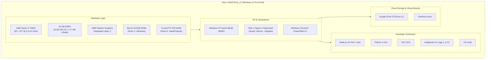
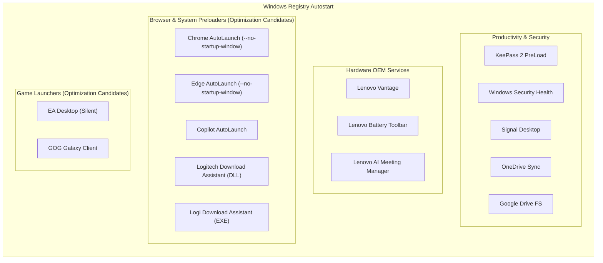

# Workstation System Architecture Specification

**Document Version:** 1.0.0  
**Last Updated:** 2026-09-08  
**Target Host:** `LENOVO16_LP` (Lenovo ThinkPad E16 Gen 1 AMD - Type `21JT001GAU`)  
**Primary User:** `benma`  
**Baseline Report:** [`reports/baseline_inventory.md`](file:///C:/Users/benma/coding/agy_project/Projects/Workstation/reports/baseline_inventory.md)

---

## 1. System Overview & Host Identity

The workstation is a high-performance, mobile developer machine running Windows 11 Pro. It functions as the primary platform for software engineering, full-stack web applications, containerized testing via WSL2, and agentic AI workflows powered by Google Antigravity.

| Attribute | Specification |
| :--- | :--- |
| **System Model** | Lenovo ThinkPad E16 Gen 1 (AMD) (`21JT001GAU`) |
| **Host Name** | `LENOVO16_LP` |
| **Operating System** | Microsoft Windows 11 Pro (64-bit), Build 10.0.26200 |
| **UEFI / BIOS** | Lenovo `R2CET45W(1.27)` (Release Date: 2025-07-22) |
| **Primary Architecture Role** | Full-Stack Engineering, AI Development, Multi-Runtime Workstation |

---

## 2. Hardware Architecture

### 2.1 Processor (CPU)
* **Model:** AMD Ryzen 5 7530U with Radeon Graphics
* **Architecture:** Zen 3 (Barcelo-R, 7nm TSMC)
* **Topology:** 6 Physical Cores / 12 Logical Processors (Threads)
* **Clock Speeds:** 2.0 GHz Base / up to 4.5 GHz Boost
* **Cache:** 16 MB L3 Cache, 3 MB L2 Cache
* **Thermal Design Power (TDP):** 15W nominal

### 2.2 Memory (RAM)
* **Installed Capacity:** 16.0 GB DDR4
* **Usable by OS:** 14.83 GB (1.17 GB reserved as Unified Memory for integrated Radeon GPU)
* **Operational Baseline:** Idle memory usage hovers around ~80-88% under active application loads and autostart background processes.

### 2.3 Graphics Processing (GPU)
* **Model:** AMD Radeon™ Graphics (Integrated, Device ID `0x15E7`)
* **Execution Units:** 7 Compute Units (448 Stream Processors)
* **Driver Version:** `31.0.21924.4004`

---

## 3. Storage Topology & Physical Disks

The system leverages a dual-NVMe configuration separating OS/runtimes from user projects and high-capacity storage.

| Drive Letter | Physical Model | Bus Type | Partition Type | File System | Total Capacity | Free Space | Utilization Role |
| :--- | :--- | :--- | :--- | :--- | :--- | :--- | :--- |
| **`C:`** | Micron MTFDKCD512TFK | NVMe PCIe Gen4 | GPT | NTFS | 474.72 GB | 203.69 GB (42.9%) | Windows OS, Program Files, User Profiles (`AppData`) |
| **`D:`** | Crucial CT1000P3SSD8 (P3) | NVMe PCIe Gen3 | GPT | NTFS | 931.50 GB | 292.76 GB (31.4%) | Secondary Data, Git repositories, Large Assets (`2_m2`) |
| **`G:`** | Virtual Google Drive FS | Virtual SCSI | GPT | FAT32 | 474.72 GB | 193.51 GB (40.8%) | Cloud mirror / Google Drive Streamed Cache |

---

## 4. Operating System & Subsystem Architecture

### 4.1 Host Operating System
* **Edition:** Windows 11 Pro
* **Kernel:** Windows NT 10.0 (Build 26200)
* **Shell Environments:**
  * Windows Terminal (`wt.exe`)
  * Windows PowerShell 5.1 (`powershell.exe`)
  * Command Prompt (`cmd.exe`)

### 4.2 Windows Subsystem for Linux (WSL 2)
* **Version:** WSL 2 (Hyper-V lightweight VM architecture)
* **Installed Distributions:**
  * `Ubuntu` (Default, Version 2, currently in **Stopped** state)
* **Memory & Resource Behavior:** In a stopped state, WSL2 consumes 0 MB of host memory. When active, memory allocation is managed by the Hyper-V dynamic memory manager unless constrained by a custom `.wslconfig`.

---

## 5. Network Architecture

The machine operates in a dual-tier networking topology: physical Wi-Fi for uplink and a virtual Hyper-V switch for WSL/container communication.

| Interface Name | Hardware / Driver Description | IPv4 Address | Subnet / Role | Status |
| :--- | :--- | :--- | :--- | :--- |
| **`Wi-Fi`** | RZ616 Wi-Fi 6E 160MHz (MediaTek / AMD) | `192.168.68.163` | Primary Internet Uplink (`192.168.68.0/24`) | **Up (Active)** |
| **`vEthernet (WSL)`** | Hyper-V Virtual Ethernet Adapter | `192.168.0.1` | Internal Host-to-WSL Bridge | **Up (Active)** |
| **`Ethernet`** | Realtek PCIe GbE Family Controller | — | On-board RJ45 Gigabit Port | Disconnected |
| **`Ethernet 2`** | Realtek USB GbE Family Controller | — | USB-C Dock / Dongle Ethernet | Disconnected |
| **`Bluetooth`** | Bluetooth Device (Personal Area Network) | — | Bluetooth PAN Tethering | Disconnected |

---

## 6. Developer Toolchains & Environment

### 6.1 Core Runtimes & Languages
* **Git:** `2.55.0.windows.3` (Located in `C:\Program Files\Git\cmd\git.exe`)
* **Python:** `Python 3.14.6` (User/System path)
* **Node.js:** `v24.16.0` (Node runtime in `C:\Program Files\nodejs\node.exe`)
* **npm:** Node Package Manager (Global scripts in `C:\Program Files\nodejs\npm.cmd`)
* **Antigravity CLI (`agy`):** `1.1.27` (Located in `%USERPROFILE%\.gemini\antigravity-cli\bin\agy.cmd`)

### 6.2 Package Managers
* **Windows Package Manager (`winget`):** `v1.29.290` (Standard Windows package management)
* **Chocolatey (`choco`):** `2.7.3` (Automated CLI software repository)

### 6.3 Development Applications
* **Visual Studio Code:** Primary IDE (`code.cmd`) located at `%LOCALAPPDATA%\Programs\Microsoft VS Code`

---

## 7. Service & Startup Topology

The workstation executes startup items categorized across system utilities, communication tools, hardware managers, and browser background pre-launchers.

### Autostart Assessment & Active Status
* **Active Daily Use:** KeePass 2, Windows Security Health, OneDrive, Google Drive File Stream, Signal Desktop, Lenovo Vantage services.
* **Transitioned to On-Demand (Disabled from Boot):**
  * `EA Desktop` (`EALauncher.exe -silent`): Removed from `HKCU Run` on 2026-09-08. Launchable on-demand.
  * `GOG Galaxy` (`GalaxyClient.exe`): Removed from `HKCU Run` on 2026-09-08. Launchable on-demand.
  * `Google Chrome AutoLaunch` (`chrome.exe --no-startup-window /prefetch:5`): Removed from `HKCU Run` on 2026-09-08.
  * `Microsoft Edge AutoLaunch` (`msedge.exe --no-startup-window`): Removed from `HKCU Run` on 2026-09-08.
  * `Microsoft Copilot AutoLaunch` (`mscopilot.exe --no-startup-window`): Removed from `HKCU Run` on 2026-09-08.
* **Remaining Optimization Candidates:**
  * Duplicate Logitech Download Assistant entries.

---

## 8. Safety Boundaries & Execution Governance

As mandated by [`AGENTS.md`](file:///C:/Users/benma/coding/agy_project/Projects/Workstation/AGENTS.md) and global engineering policies:

1. **Protected System Zones (Strict Read-Only):**
   * `C:\Windows\`
   * `C:\Program Files\Windows Defender\`
   * System bootloader, BCD, pagefile (`pagefile.sys`), swapfile (`swapfile.sys`).
   * Active personal user libraries (`Documents`, `Desktop`, `Pictures`).
2. **Tiered Execution Framework:**
   * **Tier 1 (Autonomous):** Read-only diagnosis (`Get-Command`, `Get-CimInstance`, `dir`, `git status`).
   * **Tier 2 (Low-Risk Ephemeral Cleanup):** Clearing `%TEMP%`, `npm cache`, `pip cache` after stating target paths and estimated reclamation.
   * **Tier 3 (Mutating Operations):** Registry modifications, service startup changes, uninstalls, and scheduled tasks require the formal **Pre-Flight Security Card** and explicit user approval before execution.

---

## 9. Architectural Tradeoffs & Deliberate Decisions

This workstation adheres to an explicit tradeoff discipline: no component, service, or background task should run without a deliberate purpose, and intentional performance overheads are formally acknowledged.

| Component / Subsystem | Tradeoff Decision | Justification / Operational Scope |
| :--- | :--- | :--- |
| **Game Launchers (EA, GOG)** | **Disabled from Autostart (On-Demand only)** | Developer host priority: removes background network polling, update hooks, and idle RAM consumption. Games can be launched manually when needed. |
| **Browser Pre-Launchers (Chrome, Edge, Copilot)** | **Disabled from Autostart (Full On-Demand)** | Releases ~2.2 GB - 6 GB idle RAM pressure across Chromium engines. Prevents hidden worker processes from lingering in RAM when windows are closed. Zero impact to sync, data, or Google Drive FS. Reversible via `scripts/restore_browser_autostart.ps1` or browser Settings. |
| **WSL 2 Subsystem** | **Dormant / Low Priority (Offloaded to Codebox)** | Primary development container workloads are handled on the dedicated remote codebox. Local WSL is kept for occasional offline utility with strict resource bounding. |
| **Lenovo Vantage & Power Tools** | **Retained in Autostart** | Deliberate choice to maintain battery charging threshold conservation (preserving physical battery longevity) and thermal profiles. |
| **Sync Tools (OneDrive, Google Drive, Signal)** | **Retained in Autostart** | Essential real-time collaboration and secure communication pipelines. |

---

## 10. Architectural Decisions & Maintenance History

Major architectural decisions and maintenance interventions are tracked under Architectural Decision Records (ADR) in [`CHANGELOG.md`](file:///C:/Users/benma/coding/agy_project/Projects/Workstation/CHANGELOG.md).
