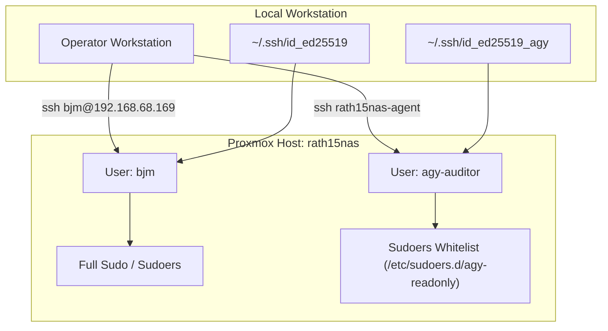

# System Architecture & Network Topology

## 1. Host Overview

* **Hostname:** `rath15nas`
* **Operating System:** Debian GNU/Linux 13 (trixie) / Proxmox VE
* **Primary IP:** `192.168.68.169/24` (via `vmbr0`)
* **Default Gateway:** `192.168.68.1`

---

## 2. Network Topology & Interfaces

| Interface | Type | IP / Subnet | State | Role / Description |
| :--- | :--- | :--- | :--- | :--- |
| `vmbr0` | Linux Bridge | `192.168.68.169/24` | UP | Management LAN & Proxmox Web GUI bridge |
| `vmbr1` | Linux Bridge | Unassigned | DOWN | Secondary bridge |
| `wg0` | WireGuard Interface | `10.10.0.4/24` | UP | WireGuard VPN tunnel (Port: `40846`) |
| `veth910i0` | Virtual Ethernet | Attached to `vmbr0` | UP | Virtual interface for LXC 910 (`codebox`) |

### Routing Table
* `default via 192.168.68.1 dev vmbr0`
* `10.10.0.0/24 dev wg0 proto kernel scope link src 10.10.0.4`
* `192.168.6.0/24 dev wg0 scope link`
* `192.168.68.0/24 dev vmbr0 proto kernel scope link src 192.168.68.169`

### WireGuard Peer Configuration (`wg0`)
* **Endpoint:** `203.132.95.12:51820`
* **Allowed IPs:** `10.10.0.0/24`, `192.168.6.0/24`
* **Persistent Keepalive:** 25 seconds

---

## 3. Virtualization Inventory

| VMID | Type | Name | Status | Memory | Notes |
| :--- | :--- | :--- | :--- | :--- | :--- |
| 910 | LXC | `codebox` | Running | - | Development container (`192.168.68.172`) |
| 900 | QEMU | `openwrt` | Stopped | 512 MB | Virtual router / firewall |
| 901 | QEMU | `test-lan` | Stopped | 512 MB | Isolated test LAN environment |

---

## 4. Access Control & Security Boundaries

Access to `rath15nas` is partitioned by role adhering to the Principle of Least Privilege (PoLP):



### 4.1. Account Matrix

* **Administrative Operator (`bjm`):**
  * Interactive administrative access.
  * Sudo access with password authentication.
  * Responsible for privileged modifications, updates, and service restarts.

* **Audit & Automation Service Account (`agy-auditor`):**
  * Non-interactive service account dedicated to automated diagnostics, auditing, and telemetry collection.
  * Password login: Disabled (`passwd -l`).
  * Authentication: Dedicated key pair (`~/.ssh/id_ed25519_agy`).
  * SSH Host Alias: `rath15nas-agent` (`HostName 192.168.68.169`, `User agy-auditor`).
  * Permissions: Strict read-only sudoers whitelist defined in `/etc/sudoers.d/agy-readonly`.

### 4.2. Sudoers Whitelist (`/etc/sudoers.d/agy-readonly`)

```sudoers
# Read-only audit permissions for agy-auditor
agy-auditor ALL=(ALL) NOPASSWD: \
    /usr/bin/wg show*, \
    /usr/sbin/iptables -S*, \
    /usr/sbin/iptables -L*, \
    /usr/sbin/nft list*, \
    /usr/sbin/pct list, \
    /usr/sbin/qm list, \
    /usr/bin/systemctl status *
```

Any mutating operations (e.g., `iptables -F`, `systemctl restart`, `wg set`, `pct start/stop`) are strictly denied.
