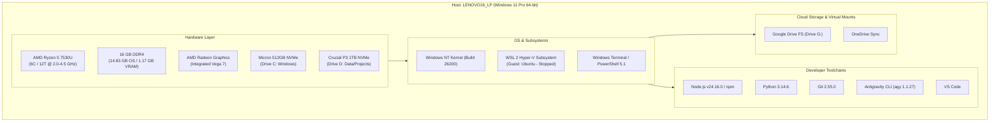
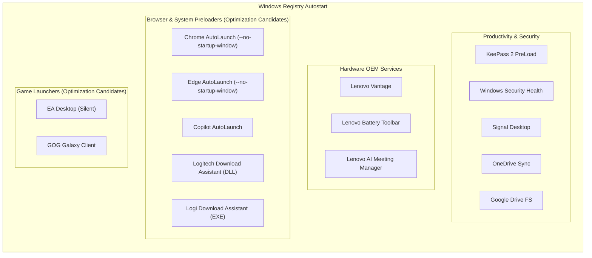
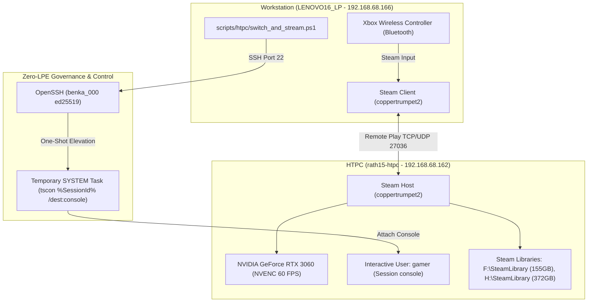

# Workstation System Architecture Specification

**Document Version:** 1.0.0  
**Last Updated:** 2026-09-08  
**Target Host:** `LENOVO16_LP` (Lenovo ThinkPad E16 Gen 1 AMD - Type `21JT001GAU`)  
**Primary User:** `benma`  
**Baseline Report:** [`reports/baseline_inventory.md`](file:///C:/Users/benma/coding/agy_project/Projects/Workstation/reports/baseline_inventory.md)

---

## 1. System Overview & Host Identity

The workstation is a high-performance, mobile developer machine running Windows 11 Pro. It functions as the primary platform for software engineering, full-stack web applications, containerized testing via WSL2, and agentic AI workflows powered by Google Antigravity.

| Attribute | Specification |
| :--- | :--- |
| **System Model** | Lenovo ThinkPad E16 Gen 1 (AMD) (`21JT001GAU`) |
| **Host Name** | `LENOVO16_LP` |
| **Operating System** | Microsoft Windows 11 Pro (64-bit), Build 10.0.26200 |
| **UEFI / BIOS** | Lenovo `R2CET45W(1.27)` (Release Date: 2025-07-22) |
| **Primary Architecture Role** | Full-Stack Engineering, AI Development, Multi-Runtime Workstation |

---

## 2. Hardware Architecture

### 2.1 Processor (CPU)
* **Model:** AMD Ryzen 5 7530U with Radeon Graphics
* **Architecture:** Zen 3 (Barcelo-R, 7nm TSMC)
* **Topology:** 6 Physical Cores / 12 Logical Processors (Threads)
* **Clock Speeds:** 2.0 GHz Base / up to 4.5 GHz Boost
* **Cache:** 16 MB L3 Cache, 3 MB L2 Cache
* **Thermal Design Power (TDP):** 15W nominal

### 2.2 Memory (RAM)
* **Installed Capacity:** 16.0 GB DDR4
* **Usable by OS:** 14.83 GB (1.17 GB reserved as Unified Memory for integrated Radeon GPU)
* **Operational Baseline:** Idle memory usage hovers around ~80-88% under active application loads and autostart background processes.

### 2.3 Graphics Processing (GPU)
* **Model:** AMD Radeon™ Graphics (Integrated, Device ID `0x15E7`)
* **Execution Units:** 7 Compute Units (448 Stream Processors)
* **Driver Version:** `31.0.21924.4004`

---

## 3. Storage Topology & Physical Disks

The system leverages a dual-NVMe configuration separating OS/runtimes from user projects and high-capacity storage.

| Drive Letter | Physical Model | Bus Type | Partition Type | File System | Total Capacity | Free Space | Utilization Role |
| :--- | :--- | :--- | :--- | :--- | :--- | :--- | :--- |
| **`C:`** | Micron MTFDKCD512TFK | NVMe PCIe Gen4 | GPT | NTFS | 474.72 GB | 203.69 GB (42.9%) | Windows OS, Program Files, User Profiles (`AppData`) |
| **`D:`** | Crucial CT1000P3SSD8 (P3) | NVMe PCIe Gen3 | GPT | NTFS | 931.50 GB | 292.76 GB (31.4%) | Secondary Data, Git repositories, Large Assets (`2_m2`) |
| **`G:`** | Virtual Google Drive FS | Virtual SCSI | GPT | FAT32 | 474.72 GB | 193.51 GB (40.8%) | Cloud mirror / Google Drive Streamed Cache |

---

## 4. Operating System & Subsystem Architecture

### 4.1 Host Operating System
* **Edition:** Windows 11 Pro
* **Kernel:** Windows NT 10.0 (Build 26200)
* **Shell Environments:**
  * Windows Terminal (`wt.exe`)
  * Windows PowerShell 5.1 (`powershell.exe`)
  * Command Prompt (`cmd.exe`)

### 4.2 Windows Subsystem for Linux (WSL 2)
* **Version:** WSL 2 (Hyper-V lightweight VM architecture)
* **Installed Distributions:**
  * `Ubuntu` (Default, Version 2, currently in **Stopped** state)
  * Disk footprint: `7.58 GB` (`ext4.vhdx` on OS Drive C:)
* **Memory & Resource Behavior:** Constrained via `%USERPROFILE%\.wslconfig` (managed from [`configs/.wslconfig`](file:///C:/Users/benma/coding/agy_project/Projects/Workstation/configs/.wslconfig)). Capped at **2 GB RAM**, **2 vCPUs**, and configured with `autoMemoryReclaim=dropcache` to actively release guest memory pages back to Windows. Prevents the default 50% / 7.5 GB dynamic grab.

---

## 5. Network Architecture

The machine operates in a dual-tier networking topology: physical Wi-Fi for uplink and a virtual Hyper-V switch for WSL/container communication.

| Interface Name | Hardware / Driver Description | IPv4 Address | Subnet / Role | Status |
| :--- | :--- | :--- | :--- | :--- |
| **`Wi-Fi`** | RZ616 Wi-Fi 6E 160MHz (MediaTek / AMD) | `192.168.68.163` | Primary Internet Uplink (`192.168.68.0/24`) | **Up (Active)** |
| **`vEthernet (WSL)`** | Hyper-V Virtual Ethernet Adapter | `192.168.0.1` | Internal Host-to-WSL Bridge | **Up (Active)** |
| **`Ethernet`** | Realtek PCIe GbE Family Controller | — | On-board RJ45 Gigabit Port | Disconnected |
| **`Ethernet 2`** | Realtek USB GbE Family Controller | — | USB-C Dock / Dongle Ethernet | Disconnected |
| **`Bluetooth`** | Bluetooth Device (Personal Area Network) | — | Bluetooth PAN Tethering | Disconnected |

---

## 6. Developer Toolchains & Environment

### 6.1 Core Runtimes & Languages
* **Git:** `2.55.0.windows.3` (System PATH: `C:\Program Files\Git\cmd\git.exe`)
* **Python:** Unified Single-Version Host Runtime `Python 3.14.6` (System PATH: `C:\Python314\python.exe`; redundant Python 3.12 uninstalled via Winget on 2026-09-08; `python3.cmd` shim installed in User PATH at `%LOCALAPPDATA%\agy\bin\python3.cmd` resolving both `python` and `python3` to 3.14 without Microsoft Store stubs).
* **Node.js:** `v24.16.0` (System PATH: `C:\Program Files\nodejs\node.exe`; invalid file path in User PATH pruned on 2026-09-08)
* **npm:** Node Package Manager (System PATH: `C:\Program Files\nodejs\npm.cmd`; User packages: `%APPDATA%\npm`)
* **Antigravity CLI (`agy`):** `1.1.27` (User PATH: `%LOCALAPPDATA%\agy\bin\agy.exe`)
* **rclone:** `v1.73.4` (User PATH: `C:\rclone\rclone-v1.73.4-windows-amd64`)

### 6.2 Package Managers
* **Windows Package Manager (`winget`):** `v1.29.290` (Standard Windows package management)
* **Chocolatey (`choco`):** `2.7.3` (Automated CLI software repository)

### 6.3 Development Applications
* **Visual Studio Code:** Primary IDE (`code.cmd`) located at `%LOCALAPPDATA%\Programs\Microsoft VS Code`

---

## 7. Service & Startup Topology

The workstation executes startup items categorized across system utilities, communication tools, hardware managers, and browser background pre-launchers.

### Autostart Assessment & Active Status
* **Active Daily Use:** KeePass 2, Windows Security Health, OneDrive, Google Drive File Stream, Signal Desktop, Lenovo Vantage services.
* **Transitioned to On-Demand (Disabled from Boot):**
  * `EA Desktop` (`EALauncher.exe -silent`): Removed from `HKCU Run` on 2026-09-08. Launchable on-demand.
  * `GOG Galaxy` (`GalaxyClient.exe`): Removed from `HKCU Run` on 2026-09-08. Launchable on-demand.
  * `Google Chrome AutoLaunch` (`chrome.exe --no-startup-window /prefetch:5`): Removed from `HKCU Run` on 2026-09-08.
  * `Microsoft Edge AutoLaunch` (`msedge.exe --no-startup-window`): Removed from `HKCU Run` on 2026-09-08.
  * `Microsoft Copilot AutoLaunch` (`mscopilot.exe --no-startup-window`): Removed from `HKCU Run` on 2026-09-08.
* **Remaining Optimization Candidates:**
  * Duplicate Logitech Download Assistant entries.

---

## 8. Safety Boundaries & Execution Governance

As mandated by [`AGENTS.md`](file:///C:/Users/benma/coding/agy_project/Projects/Workstation/AGENTS.md) and global engineering policies:

1. **Protected System Zones (Strict Read-Only):**
   * `C:\Windows\`
   * `C:\Program Files\Windows Defender\`
   * System bootloader, BCD, pagefile (`pagefile.sys`), swapfile (`swapfile.sys`).
   * Active personal user libraries (`Documents`, `Desktop`, `Pictures`).
2. **Tiered Execution Framework:**
   * **Tier 1 (Autonomous):** Read-only diagnosis (`Get-Command`, `Get-CimInstance`, `dir`, `git status`).
   * **Tier 2 (Low-Risk Ephemeral Cleanup):** Clearing `%TEMP%`, `npm cache`, `pip cache` after stating target paths and estimated reclamation.
   * **Tier 3 (Mutating Operations):** Registry modifications, service startup changes, uninstalls, and scheduled tasks require the formal **Pre-Flight Security Card** and explicit user approval before execution.

---

## 9. Architectural Tradeoffs & Deliberate Decisions

This workstation adheres to an explicit tradeoff discipline: no component, service, or background task should run without a deliberate purpose, and intentional performance overheads are formally acknowledged.

| Component / Subsystem | Tradeoff Decision | Justification / Operational Scope |
| :--- | :--- | :--- |
| **Game Launchers (EA, GOG)** | **Disabled from Autostart (On-Demand only)** | Developer host priority: removes background network polling, update hooks, and idle RAM consumption. Games can be launched manually when needed. |
| **Browser Pre-Launchers (Chrome, Edge, Copilot)** | **Disabled from Autostart (Full On-Demand)** | Releases ~2.2 GB - 6 GB idle RAM pressure across Chromium engines. Prevents hidden worker processes from lingering in RAM when windows are closed. Zero impact to sync, data, or Google Drive FS. Reversible via `scripts/restore_browser_autostart.ps1` or browser Settings. |
| **WSL 2 Subsystem** | **Guarded 2 GB Sandbox (Offloaded to Codebox)** | Primary development container workloads are handled on the dedicated remote codebox. Local WSL is kept for occasional offline utility with strict resource bounding (2 GB RAM, 2 CPUs, dropcache auto-reclaim via `.wslconfig`). |
| **Host Python Role** | **Single Runtime (3.14 Only) for Host Automation** | Full software engineering and complex packages are offloaded to devbox. The local host workstation maintains a single, clean Python 3.14 installation strictly for system utilities and host automation. Python 3.12 uninstalled; `python3` command shim active. |
| **Lenovo Vantage & Power Tools** | **Retained in Autostart** | Deliberate choice to maintain battery charging threshold conservation (preserving physical battery longevity) and thermal profiles. |
| **Sync Tools (OneDrive, Google Drive, Signal)** | **Retained in Autostart** | Essential real-time collaboration and secure communication pipelines. |
| **Microsoft GameInput** | **Standalone Redistributable Uninstalled (Native Windows 11 Service Only)** | Eliminates redundant `GameInputRedistService` and repetitive MSI reconfiguration loops (Event 1035) during sleep/idle. All game controller APIs continue to operate natively through Windows 11 `System32\GameInputSvc.exe`. |

---

## 10. Architectural Decisions & Maintenance History

Major architectural decisions and maintenance interventions are tracked under Architectural Decision Records (ADR) in [`CHANGELOG.md`](file:///C:/Users/benma/coding/agy_project/Projects/Workstation/CHANGELOG.md).

---

## 11. Automated Backup System & Data Protection Topology (Restic REST)

The workstation operates an automated, headless, zero-trust encrypted backup pipeline terminating on local network storage (`RATH15NAS`), protecting against hardware NVMe drive failure and ransomware encryption without dependency on external public cloud providers (replacing cancelled Microsoft 365 / OneDrive subscription).

### 11.1. Backend Infrastructure
* **Hypervisor Storage Host:** `RATH15NAS` (`192.168.68.169` - Proxmox VE 8.x). Btrfs subvolume `@backups` on `/dev/sdd1` mounted at `/mnt/backups` (3.6 TB free pool).
* **LXC Service Node:** CT `920` (`services` - `192.168.68.175` - Ubuntu 24.04).
  * Storage Bind-Mount: `/mnt/backups`.
  * Management: Managed via Dockge (`/opt/stacks/rest-server`).
  * Server Container: `restic/rest-server:latest` on port `8000` (TCP) with `--append-only` and `--private-repos`.
  * Repository Path: `/mnt/backups/workstation` (tenant-isolated from `htpc`).

### 11.2. Client Configuration (`LENOVO16_LP`)
* **Binary Runtime:** `restic.exe` v0.19.1 (in system `PATH`).
* **Encryption Key:** AES-256 client key stored at `C:\ProgramData\restic\repo_key.txt` with locked NTFS permissions (`SYSTEM:F`, `Administrators:F`, `benma:M`).
* **Automation Script:** `C:\ProgramData\restic\backup.ps1` with automatic log rotation (`backup.log` capped at 5 MB) and native Win32 output streaming.
* **Scheduled Task:** `\ResticBackup` executing daily at 21:00 (9:00 PM).
* **Target Datasets:** `OneDrive` (808 fully hydrated personal files), `coding` (active Git repositories), `.ssh` (client keys), `.keepsidian` (Obsidian knowledge base), `D:\Calibre_Library_Main` (13,472 files / 19.2 GB ebook archive), `Documents`, `Desktop`, `Pictures`.
* **Exclusions:** `Saved Games` (verified 100% cloud-synced via Steam Cloud), `.venv`, `node_modules`, `__pycache__`, `Downloads`, `AppData\Local\Temp`.
* **Authoritative Policy:** Documented in [`backup_strategy.md`](backup_strategy.md).

### 11.3. Calibre Media Synchronization Pipeline
* **Purpose:** Headless, non-destructive synchronization of the primary curated Calibre digital ebook collection to local NAS media storage, feeding the containerized Calibre-Web reader service without risk of purging manually uploaded web titles.
* **Source Dataset:** `D:\Calibre_Library_Main` (~19.2 GB / 3,257 author directories, `metadata.db`).
* **Destination Target:** `S:\Media\Books` (`\\RATH15NAS\simba\Media\Books` / host path `/mnt/simba/Media/Books`).
* **Client Automation Script:** `C:\ProgramData\calibre-sync\sync_calibre.ps1` (versioned in [`scripts/sync_calibre.ps1`](scripts/sync_calibre.ps1)).
* **Sync Strategy:** Additive-only (`robocopy.exe /E /XO /FFT /R:2 /W:2 /MT:8 /NP /NDL`). Deletions (`/MIR`, `/PURGE`) are explicitly omitted to preserve titles uploaded directly to Calibre-Web or NAS storage.
* **Scheduled Task:** `\CalibreSyncDaily` running daily at 21:30 (9:30 PM) under the interactive user principal (`benma`).
* **Service Consumer:** CT `920` (`services`), container `calibre-web` mounting `/mnt/simba/Media/Books:/books` (Port 8083).

---

## 12. In-Home Headless Game Streaming Topology (HTPC Remote Play)

The workstation operates as a lightweight, low-latency streaming client for high-end PC gaming rendered remotely on `rath15-htpc`, completely independent of the physical living room television.

### 12.1. Host & Hardware Specifications
* **Target Node:** `rath15-htpc` (`192.168.68.162` on local subnet `192.168.68.0/24`).
* **GPU & Acceleration:** NVIDIA GeForce RTX 3060 (12GB GDDR6, Driver `32.0.15.9621`). NVENC hardware encoder (H.264 / HEVC) delivers 60 FPS video capture with sub-10ms network transport latency.
* **Audio Pipeline:** Low-latency digital audio capture routed via Steam Streaming Speakers.
* **Storage Distribution:** OS on `C:`, dedicated Steam Libraries on `F:\SteamLibrary` (155 GB free) and `H:\SteamLibrary` (372 GB free).

### 12.2. Zero-LPE Security Architecture & TV Independence
* **Physical TV Isolation:** The physical TV screen connected to `rath15-htpc` operates on an alternate HDMI input (Google TV for children's viewing). Windows session handoffs (`tscon %SessionId% /dest:console`) bind directly to the physical display adapter without sending HDMI CEC commands or disrupting active TV playback.
* **Least Privilege Execution (Zero-LPE):** 
  * Gaming workloads execute strictly under local unprivileged user `gamer` (member of `Remote Desktop Users` only).
  * `gamer` possesses **zero administrative privileges** and **zero persistent SYSTEM-elevated scheduled tasks**, eliminating local privilege escalation (LPE) vulnerabilities from malicious game mods or third-party executables.
  * Console session handoffs are triggered exclusively from the Workstation over authenticated OpenSSH using the administrative `benka_000` ed25519 key.

### 12.3. Client Automation & Toolchain
* **Automation Entrypoint:** [`scripts/htpc/switch_and_stream.ps1`](scripts/htpc/switch_and_stream.ps1)
  1. Inspects active HTPC sessions via SSH.
  2. If foreign users are on console, performs graceful logoff.
  3. Detects `gamer` RDP session and executes one-shot SYSTEM `tscon` console attachment via [`scripts/htpc/do_tscon.ps1`](scripts/htpc/do_tscon.ps1).
  4. Deploys and executes [`scripts/htpc/ensure_steam_stream.ps1`](scripts/htpc/ensure_steam_stream.ps1) to confirm Steam is running in the active GPU console session with persistent authentication under `coppertrumpet2`.
  5. Validates Steam Remote Play TCP port `27036`.
* **Telemetry Utility:** [`scripts/htpc/get_screenshot.ps1`](scripts/htpc/get_screenshot.ps1) captures non-invasive, DPI-aware 4K desktop screenshots of the active console session without user disruption.
* **Controller Routing:** Physical Xbox controller connects wirelessly via Bluetooth to the Workstation; Steam Input translates gamepad controls directly into target DirectX 9/11/12 game runtimes.

