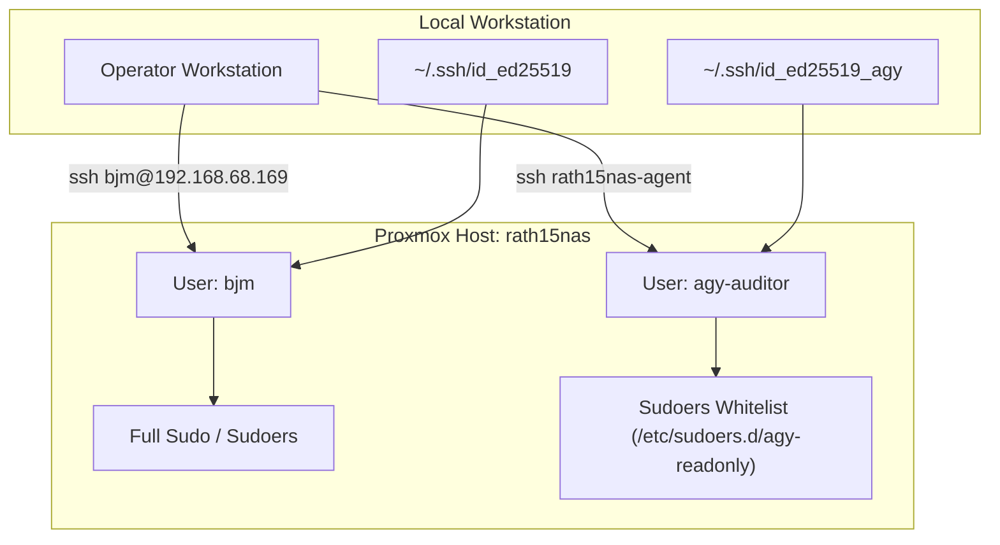

# System Architecture & Network Topology

## 1. Host Overview

* **Hostname:** `rath15nas`
* **Operating System:** Debian GNU/Linux 13 (trixie) / Proxmox VE
* **Primary IP:** `192.168.68.169/24` (via `vmbr0`)
* **Default Gateway:** `192.168.68.1`

---

## 2. Network Topology & Interfaces

| Interface | Type | IP / Subnet | State | Role / Description |
| :--- | :--- | :--- | :--- | :--- |
| `vmbr0` | Linux Bridge | `192.168.68.169/24` | UP | Management LAN & Proxmox Web GUI bridge |
| `vmbr1` | Linux Bridge | Unassigned | DOWN | Secondary bridge |
| `wg0` | WireGuard Interface | `10.10.0.4/24` | UP | WireGuard VPN tunnel (Port: `40846`) |
| `veth910i0` | Virtual Ethernet | Attached to `vmbr0` | UP | Virtual interface for LXC 910 (`codebox`) |

### Routing Table
* `default via 192.168.68.1 dev vmbr0`
* `10.10.0.0/24 dev wg0 proto kernel scope link src 10.10.0.4`
* `192.168.6.0/24 dev wg0 scope link`
* `192.168.68.0/24 dev vmbr0 proto kernel scope link src 192.168.68.169`

### WireGuard Peer Configuration (`wg0`)
* **Endpoint:** `203.132.95.12:51820`
* **Allowed IPs:** `10.10.0.0/24`, `192.168.6.0/24`
* **Persistent Keepalive:** 25 seconds
* **Systemd Service:** `wg-quick@wg0.service` (`enabled` on boot)

### 2.1. Gateway & NAT Forwarding (Cross-Subnet Access)

To enable client devices on the local LAN (`192.168.68.0/24`) to route to the remote subnet (`192.168.6.0/24`) through Proxmox without requiring changes to the remote peer's routing or AllowedIPs:

* **Kernel IPv4 Forwarding:** `net.ipv4.ip_forward = 1` (persisted via `/etc/sysctl.d/99-wireguard-forwarding.conf`).
* **Lifecycle NAT & Filter Hooks (`/etc/wireguard/wg0.conf`):**
  Rules are automatically applied on tunnel up and cleaned up on tunnel down via `wg-quick` directives:
  ```ini
  PostUp = iptables -t nat -A POSTROUTING -o %i -j MASQUERADE; iptables -A FORWARD -o %i -d 192.168.6.0/24 -j ACCEPT; iptables -A FORWARD -i %i -m conntrack --ctstate RELATED,ESTABLISHED -j ACCEPT
  PostDown = iptables -t nat -D POSTROUTING -o %i -j MASQUERADE; iptables -D FORWARD -o %i -d 192.168.6.0/24 -j ACCEPT; iptables -D FORWARD -i %i -m conntrack --ctstate RELATED,ESTABLISHED -j ACCEPT
  ```
* **Workstation Route:**
  * Windows persistent route: `route -p add 192.168.6.0 mask 255.255.255.0 192.168.68.169`


---

## 3. Storage & Filesystem Architecture

### 3.1. Drive Layout & Btrfs RAID1 Pool

Heterogeneous spinning disk pool configured with Btrfs native chunk mirroring (`raid1` data and metadata):

| Device | Partition | Physical Disk | Size | Role / Filesystem |
| :--- | :--- | :--- | :--- | :--- |
| `/dev/sdd` | `/dev/sdd1` | Seagate IronWolf (`ST4000VN008`) | 3.6 TB | Member of Btrfs pool `data` |
| `/dev/sde` | `/dev/sde1` | WD Red (`WD40EFRX`) | 3.6 TB | Member of Btrfs pool `data` |
| `/dev/sdc` | `/dev/sdc1` | WD Purple (`WD30PURX`) | 2.7 TB | Member of Btrfs pool `data` |
| `/dev/sdb` | *(None)* | Crucial BX500 SSD (`CT1000BX500SSD1`) | 931.5 GB | Spare unallocated flash drive |
| `/dev/sda` | `/dev/sda1..3` | Crucial BX500 SSD (`CT1000BX500SSD1`) | 931.5 GB | PVE Host Boot / OS / LVM thin pool |

* **Pool Mount Point:** `/mnt/data`
* **Usable Protected Storage:** $\approx 4.95\text{ TB}$ (1-disk fault tolerance).
* **Mount Parameters (`/etc/fstab`):**
  ```fstab
  UUID=<FS_UUID>  /mnt/data  btrfs  defaults,noatime,compress=zstd:1,space_cache=v2,nofail,x-systemd.device-timeout=15s  0  2
  ```
* **Subvolume Layout:**
  * `/mnt/data/@simba` — Primary Windows Samba network share.
  * `/mnt/data/@shares` — Secondary / general network storage.
  * `/mnt/data/@backups` — Proxmox host and client backup datasets.

### 3.2. Windows File Sharing (Samba / SMB3)

* **Service Daemon:** `smbd.service` (managed via systemd, auto-enabled).
* **Discovery Daemon:** `wsdd.service` (Web Services Dynamic Discovery for Windows Explorer).
* **Share Name:** `[simba]` $\rightarrow$ `/mnt/data/@simba`
* **Windows Tuning & Compatibility:**
  * Protocol: `SMB3` with multi-channel support (`server multi channel support = yes`).
  * High-Throughput I/O: Asynchronous I/O (`aio read/write size = 1`), `use sendfile = yes`.
  * NTFS / Windows Compatibility: `store dos attributes = yes`, `ea support = yes`, `vfs objects = streams_xattr acl_xattr`.
  * Access Control: Restricted to user `bjm` with forced user/group ownership (`bjm:bjm`, masks `0664`/`0775`).

---

## 4. Virtualization Inventory


| VMID | Type | Name | Status | Memory | Notes |
| :--- | :--- | :--- | :--- | :--- | :--- |
| 910 | LXC | `codebox` | Running | - | Development container (`192.168.68.172`) |
| 900 | QEMU | `openwrt` | Stopped | 512 MB | Virtual router / firewall |
| 901 | QEMU | `test-lan` | Stopped | 512 MB | Isolated test LAN environment |

---

## 5. Access Control & Security Boundaries

Access to `rath15nas` is partitioned by role adhering to the Principle of Least Privilege (PoLP):



### 5.1. Account Matrix

* **Administrative Operator (`bjm`):**
  * Interactive administrative access.
  * Sudo access with password authentication.
  * Responsible for privileged modifications, updates, and service restarts.

* **Audit & Automation Service Account (`agy-auditor`):**
  * Non-interactive service account dedicated to automated diagnostics, auditing, and telemetry collection.
  * Password login: Disabled (`passwd -l`).
  * Authentication: Dedicated key pair (`~/.ssh/id_ed25519_agy`).
  * SSH Host Alias: `rath15nas-agent` (`HostName 192.168.68.169`, `User agy-auditor`).
  * Permissions: Strict read-only sudoers whitelist defined in `/etc/sudoers.d/agy-readonly`.

### 5.2. Sudoers Whitelist (`/etc/sudoers.d/agy-readonly`)

```sudoers
# Read-only audit permissions for agy-auditor
agy-auditor ALL=(ALL) NOPASSWD: \
    /usr/bin/wg show*, \
    /usr/sbin/iptables -S*, \
    /usr/sbin/iptables -L*, \
    /usr/sbin/nft list*, \
    /usr/sbin/pct list, \
    /usr/sbin/qm list, \
    /usr/bin/systemctl status *
```

### 5.3. Privilege History & Posture Status

* **Current Status:** Purely read-only least privilege (`/etc/sudoers.d/agy-readonly`).
* **Operational History:** Temporary execution privileges (`/etc/sudoers.d/agy-wireguard`) granted for initial interface synchronization and testing were revoked upon completion of host configuration. Mutating actions remain strictly forbidden.

Any mutating operations (e.g., `iptables -F`, `systemctl restart`, `wg set`, `pct start/stop`) are strictly denied.

---

## 6. Agent & Tooling Environment

* **Workstation AGY Agent:** Runs on the operator's Windows laptop, connecting remotely via `ssh rath15nas-agent` for telemetry and diagnostics.
* **Host-Local AGY Agent:** Installed directly on `rath15nas` (`~/.local/bin/agy` v1.1.27) for local terminal-driven administration and maintenance tasks.
* **Automation Scripts:** Maintained under [`scripts/`](scripts/) for turnkey, reproducible deployments ([`deploy-samba.ps1`](scripts/deploy-samba.ps1), [`setup-samba.sh`](scripts/setup-samba.sh)).
