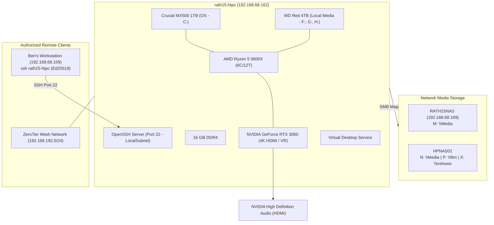

# rath15-htpc System Architecture Specification

## 1. Node Overview & System Purpose

`rath15-htpc` is a dedicated high-performance living room Home Theater PC (HTPC), media rendering node, and gaming workstation operating on the local home network. It provides 4K hardware-accelerated video decoding, multi-channel HDMI audio passthrough, VR streaming (via Virtual Desktop / Oculus), PC gaming (Steam, Epic Games), and network media ingestion from centralized network storage (`RATH15NAS` and legacy `HPNAS01`).



---

## 2. Hardware Architecture & Specifications

| Parameter | Specification | Details / Status |
| :--- | :--- | :--- |
| **Node Identity** | `RATH15-HTPC` | Local Workgroup Node |
| **Operating System** | Microsoft Windows 11 Pro (64-bit) | Build `10.0.26200` |
| **Processor** | AMD Ryzen 5 5600X 6-Core Processor | 6 Cores / 12 Threads (Zen 3) |
| **Motherboard** | MSI MAG B550 TOMAHAWK (MS-7C91) | AMD B550 Chipset, Dual PCIe / Dual M.2 |
| **System Memory** | 15.93 GB Total Physical RAM | 4.32 GB Free / 11.61 GB Active Working Set |
| **System Uptime** | Healthy / Stable | 0 Kernel-Power 41 events; 0 WHEA hardware faults |

---

## 3. Graphics, Display & Audio Pipeline

As a dedicated media and gaming endpoint, `rath15-htpc` relies on a discrete NVIDIA GPU for display output and hardware decoding:

### 3.1. Video Controllers (GPUs)
* **Primary Discrete GPU:** `NVIDIA GeForce RTX 3060`
  * **Driver Version:** `32.0.15.9621`
  * **Resolution:** `3840 x 2160` (4K UHD) @ 32-bit true color
  * **Capabilities:** Hardware NVDEC / NVENC (AV1, HEVC, H.264), Ray Tracing, DLSS
* **Virtual Display Monitor:** `Virtual Desktop Monitor` (v15.39.56.845)
  * Mirrors / extends 4K display for wireless VR streaming to standalone headsets.

### 3.2. Audio Subsystems
* **HDMI Passthrough:** `NVIDIA High Definition Audio` (Direct digital bitstream / Atmos / DTS-HD to AV receiver or TV).
* **Motherboard Analog:** `Realtek High Definition Audio`.
* **Streaming & VR Audio:**
  * `Steam Streaming Speakers & Microphone`
  * `Oculus Virtual Audio Device`
  * `Virtual Desktop Audio`
  * `NVIDIA Virtual Audio Device (Wave Extensible)`

---

## 4. Storage Topology & Drive Mappings

The storage architecture is divided between high-speed local SATA SSD storage for the OS/apps, a large mechanical storage disk for bulk files, and multiple network mounts for media libraries.

### 4.1. Physical Disks
| Disk ID | Model | Media | Bus | Capacity | Health Status | Operational Status |
| :--- | :--- | :--- | :--- | :--- | :--- | :--- |
| **Disk 0** | `CT1000MX500SSD1` | SSD | SATA | 931.5 GB | **Healthy** | OK |
| **Disk 1** | `WDC WD40EFRX-68N32N0` | HDD | SATA | 3,726 GB (4TB) | **Healthy** | OK |

### 4.2. Local Logical Partitions
| Drive | Root | Total (GB) | Used (GB) | Free (GB) | % Free | Role / Description |
| :--- | :--- | :--- | :--- | :--- | :--- | :--- |
| **C:** | `C:\` | 930.6 GB | 454.3 GB | **476.3 GB** | **51.2%** | Windows 11 OS, Applications, Dedicated Paging File (`pagefile.sys`) |
| **D:** | `D:\` | 7.9 GB | 7.9 GB | **0.0 GB** | **0.0%** | Recovery / Reserved Image Partition |
| **F:** | `F:\` | 1,401.8 GB | 1,295.9 GB | **105.9 GB** | **7.6%** | Mechanical Disk Partition 1 (Local Media / Games; +13.9 GB freed via Recycle Bin) |
| **G:** | `G:\` | 957.0 GB | 875.1 GB | **81.9 GB** | **8.6%** | Mechanical Disk Partition 2 (Downloads / Secondary Steam Library; +4.0 GB freed) |
| **H:** | `H:\` | 1,367.2 GB | 1,274.4 GB | **92.8 GB** | **6.8%** | Mechanical Disk Partition 3 (Archive Media / Modern Warfare; +8.7 GB freed) |

### 4.3. Virtual Memory & Paging Topology
* **Dedicated SSD Paging:** Windows Virtual Memory (`PagingFiles`) is consolidated strictly onto high-speed Crucial MX500 SATA SSD storage (`C:\pagefile.sys 8000 16000`).
* **Mechanical Partition Paging Elimination:** Redundant 8 GB pagefiles previously bound to `F:\`, `G:\`, and `H:\` (and legacy missing `E:\`) have been decommissioned to stop 5,400 RPM mechanical head thrashing and recover 24 GB across the WD Red drive following next restart.

### 4.4. Network SMB Mounts
| Drive Letter | Remote UNC Path | Target Host | Purpose |
| :--- | :--- | :--- | :--- |
| **M:** | `\\192.168.68.169\Media` | `RATH15NAS` | Primary Centralized Media Pool (Simba) |
| **N:** | `\\HPNAS01\files\Media` | `HPNAS01` | Secondary / Legacy NAS Media Files |
| **P:** | `\\HPNAS01\film` | `HPNAS01` | Movies / Feature Films Library |
| **X:** | `\\HPNAS01\tvshows` | `HPNAS01` | Television Series Library |

---

## 5. Network Architecture & Interfaces

`rath15-htpc` maintains multiple network layers supporting local gigabit streaming, mesh VPN access, and privacy routing:

| Interface Alias | IP Address | Subnet / Role | Hardware / Type | Status |
| :--- | :--- | :--- | :--- | :--- |
| **Ethernet 9** | `192.168.68.162` | `/24` (Primary LAN) | Realtek PCIe GbE Controller (1 Gbps) | **Up / Active** |
| **ZeroTier One** | `192.168.192.2` | `/24` (Mesh VPN) | Virtual Mesh Network `9bee8941b5f97bbb` | **Up / Active** |
| **NordLynx** | `10.5.0.2` | `/16` (VPN Tunnel) | WireGuard-based VPN Interface | **Up / Active** |
| **Local Area Connection** | Wireless | Direct Peripheral Link | Xbox Wireless Controller Adapter (600 Mbps) | **Connected** |

---

## 6. Autostart Applications & Background Services

### 6.1. Active Autostart Applications
* **Discord (`Discord.exe`):** Explicitly retained in autostart for both user profiles (`benka_000` and `dylan_93nze6m`) to support Ben's son chatting with friends while gaming without manual launch friction.
* **Virtual Desktop Service (`VirtualDesktop.Service`):** Background streamer for Oculus / Quest VR head-mounted displays.
* **Xbox Wireless Controller (`XboxStat.exe`):** Microsoft Xbox 360/One wireless controller driver daemon.
* **Logitech SetPoint (`SetPoint.exe`):** Living room keyboard / trackpad peripheral driver.
* **Microsoft OneDrive (`OneDrive.exe /background`):** User profile cloud storage synchronization.
* **NordVPN (`NordVPN.exe`):** Network privacy and tunnel manager.
* **Acronis True Image Scheduler (`schedhlp.exe`):** System image backup scheduler.
* **Greenshot (`Greenshot.exe`):** Screen capture utility.

### 6.2. On-Demand Software Stack (Pruned from Boot)
To reclaim ~3.0–4.5 GB of system memory and prevent idle Chromium/CEF thread contention, the following applications were transitioned from headless autostart to on-demand execution:
* **Steam Client (`steam.exe -silent`):** Run on-demand when playing Steam games or launching via living room UI.
* **Epic Games Launcher (`EpicGamesLauncher.exe -silent`):** Run on-demand for Epic titles.
* **Microsoft Edge (`msedge.exe`):** Startup Boost and pre-launch autostart disabled; browser runs exclusively when opened.
* **Apple iCloud Services (`iCloudServices.exe`):** Run on-demand.
* **Xtreme Download Manager (`XDM`):** Fully uninstalled via MSI uninstaller (`{694CC410-5DD4-40F4-B92C-914FE66313FD}`); bundled Java runtime and application files removed.

### 6.3. Decommissioned / Disabled Services
* **ASUS Com Service (`asComSvc`):** Set to `Disabled`. Orphaned ASUS utility service (`atkexComSvc.exe`) that caused recurring 45-second boot timeouts and System Event 7000/7009 errors on the host's MSI MAG B550 TOMAHAWK motherboard.

---

## 7. Remote Management & Security Boundaries

### 7.1. OpenSSH Server Configuration (Primary Management Channel)
* **Daemon:** Windows OpenSSH Server (`sshd`) running on port `22` (TCP).
* **Startup Type:** `Automatic` (Managed by Windows Service Control Manager).
* **Firewall Scoping:** Inbound TCP Port 22 is strictly restricted to `LocalSubnet` (`192.168.68.0/24`) on the `Private` network profile. WAN/Internet access is blocked.
* **Authentication Method:** Asymmetric Ed25519 Public Key Authentication only.
  * Ben's Workstation Key: `ssh-ed25519 AAAAC3NzaC1lZDI1NTE5AAAAIIZ770T1Rk509xop3YRfue50lvOY9fPd0w8jckwNWYi3`
  * Deployed to: `C:\ProgramData\ssh\administrators_authorized_keys` with strict ACLs (`SYSTEM` and `Administrators` only).
* **Workstation Host Alias:** Configured in `~/.ssh/config`:
  ```text
  Host rath15-htpc
      HostName 192.168.68.162
      User benka_000
      IdentityFile ~/.ssh/id_ed25519
  ```

### 7.2. Remote Desktop (RDP)
* **Status:** Service active (`TermService`), port 3389 open. Secondary fallback to SSH.

---

## 8. Stability Baseline & Health Telemetry

* **Hardware Faults (WHEA):** **0** errors over the trailing 7 days.
* **Kernel-Power 41 (Unexpected Reboots):** **0** occurrences.
* **Event Errors:** 60 System event errors and 25 Application errors over 7 days (normal background Windows telemetry noise).
* **Operating Temperatures & Volatiles:** Stable; hardware functioning within nominal thermal parameters.
