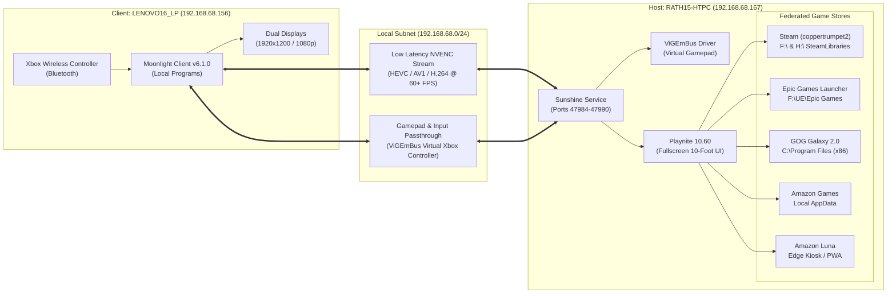

# Federated Remote Gaming Architecture Specification

**Document Version:** 1.0.0  
**Last Updated:** 2026-09-12  
**Target Hosts:** 
* **Client (Workstation):** `LENOVO16_LP` (Lenovo ThinkPad E16 Gen 1 AMD - Type `21JT001GAU`)
* **Host (Gaming Rig):** `RATH15-HTPC` (MSI MAG B550 TOMAHAWK, AMD Ryzen 5 5600X, NVIDIA RTX 3060 12GB)  
**Primary User:** `benma` / `benka_000`  

---

## 1. System Overview & Federated Streaming Topology

The Federated Remote Gaming system allows the workstation (`LENOVO16_LP`) to operate as a low-latency, high-fidelity client for playing PC games across **Steam, Epic Games, GOG Galaxy, and Amazon Games / Luna**, rendered remotely on `RATH15-HTPC` via hardware-accelerated NVENC video capture.

---

## 2. Host Architecture (`RATH15-HTPC`)

* **IP Address:** `192.168.68.167` / `rath15-htpc.local` (Wired Gigabit Ethernet `Realtek PCIe GbE Family Controller`)
* **Operating System:** Windows 11 Pro (64-bit), Build `10.0.26200`
* **CPU:** AMD Ryzen 5 5600X (6 Cores / 12 Threads, Zen 3)
* **GPU:** NVIDIA GeForce RTX 3060 (12GB GDDR6, Driver `32.0.15.9621`)
  * Hardware Encoder: NVENC (HEVC, H.264, AV1)
* **Physical Display:** Sony 4K TV (`SONY TV *30` via HDMI). When TV is in standby or displaying another HDMI input (Google TV), the session runs headlessly on the GPU console.
* **Streaming Service:** **Sunshine Service** (LizardByte v2026.906.222525)
  * Location: `C:\Program Files\Sunshine`
  * Service Name: `SunshineService` (Automatic Startup)
  * Configuration: `C:\Program Files\Sunshine\config\sunshine.conf` & `apps.json`
  * Management UI: `https://rath15-htpc.local:47990` (Local IP dynamic DHCP: `192.168.68.33`)
* **Controller Emulation:** **ViGEmBus** (`Nefarius Virtual Gamepad Emulation Bus Driver`, Status: Active)

---

## 3. Client Architecture (`LENOVO16_LP`)

* **IP Address:** `192.168.68.156` (MediaTek / AMD RZ616 Wi-Fi 6E 160MHz, ~866 Mbps link)
* **Operating System:** Windows 11 Pro (64-bit), Build `10.0.26200`
* **CPU:** AMD Ryzen 5 7530U with Radeon Graphics (6 Cores / 12 Threads)
* **Client Software:** **Moonlight Game Streaming Client v6.1.0**
  * Binary Location: `%LOCALAPPDATA%\Programs\Moonlight\Moonlight.exe`
  * Shortcut: `%APPDATA%\Microsoft\Windows\Start Menu\Programs\Moonlight.lnk`
* **Peripherals:** Xbox Wireless Controller paired via Bluetooth.

---

## 4. Federated Game Catalog Integration

The system aggregates four distinct digital distribution stores into a single controller-driven interface powered by **Playnite Fullscreen Mode**:

| Store | Integration Mechanism on Host | Target Path / Details |
| :--- | :--- | :--- |
| **Steam** | Playnite `SteamLibrary_Builtin` extension | Account `coppertrumpet2`; libraries on `F:\SteamLibrary` & `H:\SteamLibrary` |
| **Epic Games** | Playnite `EpicGamesLibrary_Builtin` extension | Client located at `F:\UE\Epic Games\` |
| **GOG Galaxy** | Playnite built-in GOG library sync | Client located at `C:\Program Files (x86)\GOG Galaxy\` |
| **Amazon Games** | Playnite `AmazonLibrary_Builtin` extension | Client located at `C:\Users\benka_000\AppData\Local\Amazon Games\` |
| **Amazon Luna** | Custom Playnite Web / PWA shortcut | `msedge.exe --app="https://luna.amazon.com"` |

---

## 5. Security Boundaries & Zero-LPE Session Management

1. **Physical TV Isolation:** Games are rendered on the host GPU console without sending HDMI CEC commands or interfering with the physical TV screen if in use by family members.
2. **Session Handoff:** Session transitions are authenticated using administrative OpenSSH Ed25519 keys (`benka_000`) and attached to the physical GPU console via `tscon %SessionId% /dest:console`.
3. **Least Privilege Runtime:** Games and launchers run within the authenticated user space without requiring persistent elevated SYSTEM privileges.

---

## 6. Automated Console Handoff Pipeline (`Start-RemoteGaming.ps1`)

In shared multi-user living room environments, local logins at the TV (e.g., `dylan_93nze6m`) disconnect the remote gaming session and take ownership of the physical GPU console. Because Sunshine tracks the active console, running user-specific binaries (like `Playnite.FullscreenApp.exe` in `C:\Users\benka_000\...`) from another user's session results in Windows `ERROR_ACCESS_DENIED (5)`.

To eliminate manual handoffs, the client provides an automated launcher ([`Start-RemoteGaming.ps1`](Start-RemoteGaming.ps1)) with a dedicated desktop shortcut:

1. **Pre-flight Probe:** Tests SSH connectivity to `rath15-htpc.local`.
2. **Session Arbitration:** Inspects `qwinsta` output. If `benka_000` is disconnected, executes `tscon <SessionId> /dest:console` over SSH.
3. **Daemon Synchronization:** Sunshine automatically re-targets to `benka_000`'s session upon console attachment.
4. **Client Launch:** Boots Moonlight directly into the ready-to-stream session.
