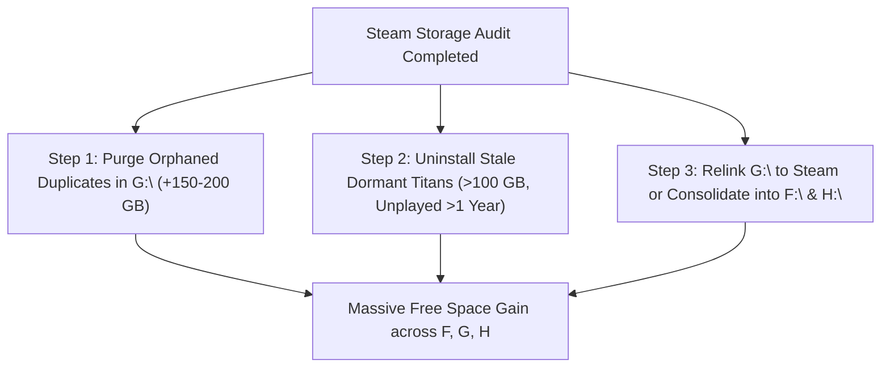

# Steam Library Storage & Games Audit (rath15-htpc)

Generated: 2026-09-10 11:30:00  
Scope: All local Steam libraries on SSD (`C:\`) and 4TB WD Red mechanical HDD (`F:\`, `G:\`, `H:\`).

---

## 1. Executive Summary & Critical Findings

A non-invasive ACF manifest inspection discovered **250 installed Steam game instances** consuming **~2.61 TB** of local disk storage. 

```
Total Steam Games Cataloged:     250 installations
Total Steam Storage Footprint:   2,614.27 GB (~2.61 TB)
  ├── C:\ (Crucial MX500 SSD):     119.03 GB (8 games)
  ├── F:\ (Mechanical Part 1):     909.32 GB (98 games)
  ├── G:\ (Mechanical Part 2):     491.91 GB (85 games)  <-- [ORPHANED]
  └── H:\ (Mechanical Part 3):   1,094.02 GB (59 games)

Wasted Duplicate Storage:        231.48 GB across 43 duplicate game titles!
```

### 🚨 Major Architecture Finding: Orphaned `G:\SteamLibrary`
* **Root Cause:** Steam's central configuration file (`C:\Program Files (x86)\Steam\steamapps\libraryfolders.vdf`) only registers libraries on **`C:`**, **`F:`**, and **`H:`**.
* **The Problem:** `G:\SteamLibrary` is **not registered in Steam**. As a result, the Steam client is completely unaware of the **85 games (491.91 GB)** sitting on `G:`.
* **The Consequences:** When games were installed or updated, Steam re-downloaded titles to `F:` and `H:`, creating **43 duplicate game titles consuming 231.48 GB of redundant storage**.
* **Reclamation Opportunity:** Purging duplicate titles in `G:\SteamLibrary` or safely consolidating the orphaned games immediately unlocks **hundreds of gigabytes** on the mechanical drive.

---

## 2. Top Duplicate Games (231.5 GB of Wasted Storage)

These games are installed in multiple libraries simultaneously on the same physical drive:

| Game Title | AppID | Copy 1 (Active) | Copy 2 (Duplicate / Orphaned) | Wasted Space | Last Played |
| :--- | :--- | :--- | :--- | :--- | :--- |
| **STAR WARS Jedi: Fallen Order** | `1172380` | `F:\SteamLibrary` (56.15 GB) | `G:\SteamLibrary` (55.98 GB) | **55.98 GB** | *Never* |
| **Zero Caliber VR** | `877200` | `F:\SteamLibrary` (28.19 GB) | `H:\SteamLibrary` (19.00 GB) | **19.00 GB** | *Never* |
| **Batman: Arkham City GOTY** | `200260` | `F:\SteamLibrary` (18.58 GB) | `G:\SteamLibrary` (18.58 GB) | **18.58 GB** | *Never* |
| **HYPERCHARGE: Unboxed** | `523660` | `H:\SteamLibrary` (13.87 GB) | `G:\SteamLibrary` (13.22 GB) | **13.22 GB** | 2025-01-03 |
| **Disney Infinity 3.0: Gold** | `541670` | `F:\SteamLibrary` (13.48 GB) | `G:\SteamLibrary` (13.48 GB) | **13.48 GB** | *Never* |
| **Railway Empire** | `503940` | `H:\SteamLibrary` (12.07 GB) | `G:\SteamLibrary` (12.07 GB) | **12.07 GB** | 2026-06-28 |
| **Planet Coaster** | `493340` | `F:\SteamLibrary` (11.47 GB) | `G:\SteamLibrary` (11.50 GB) | **11.50 GB** | 2026-09-04 |
| **Star Wars: Battlefront 2 (2005)** | `6060` | `F:\SteamLibrary` (9.59 GB) | `G:\SteamLibrary` (9.59 GB) | **9.59 GB** | *Never* |
| **Override** | `709440` | `H:\SteamLibrary` (7.80 GB) | `G:\SteamLibrary` (7.80 GB) | **7.80 GB** | 2024-08-03 |
| **Hollow Knight** | `367520` | `F:\SteamLibrary` (4.87 GB) | `G:\SteamLibrary` (7.43 GB) | **7.43 GB** | 2026-06-06 |
| **LEGO MARVEL Super Heroes** | `249130` | `H:\SteamLibrary` (6.05 GB) | `G:\SteamLibrary` (6.05 GB) | **6.05 GB** | 2025-03-18 |
| **Mini Ninjas** | `35000` | `F:\SteamLibrary` (5.80 GB) | `G:\SteamLibrary` (5.80 GB) | **5.80 GB** | 2026-08-08 |
| **Raft** | `648800` | `F:\SteamLibrary` (7.24 GB) | `G:\SteamLibrary` (5.14 GB) | **5.14 GB** | 2024-09-08 |
| **Amazing Frog?** | `332570` | `F:\SteamLibrary` (9.49 GB) | `G:\SteamLibrary` (4.94 GB) | **4.94 GB** | 2026-09-04 |
| **Hello Neighbor** | `521890` | `F:\SteamLibrary` (4.79 GB) | `H:\SteamLibrary` (4.79 GB) | **4.79 GB** | 2026-02-09 |
| **Totally Accurate Battle Simulator** | `508440` | `F:\SteamLibrary` (4.49 GB) | `G:\SteamLibrary` (4.61 GB) | **4.61 GB** | 2026-08-08 |
| **SteamVR Performance Test** | `323910` | `F:\SteamLibrary` (4.58 GB) | `G:\SteamLibrary` (4.58 GB) | **4.58 GB** | *Never* |
| **LEGO Star Wars: The Complete Saga** | `32440` | `F:\SteamLibrary` (4.36 GB) | `G:\SteamLibrary` (4.36 GB) | **4.36 GB** | *Never* |
| **SW: Knights of the Old Republic** | `32370` | `H:\SteamLibrary` (3.36 GB) | `G:\SteamLibrary` (3.36 GB) | **3.36 GB** | 2025-06-15 |
| **For The King** | `527230` | `H:\SteamLibrary` (2.46 GB) | `G:\SteamLibrary` (2.31 GB) | **2.31 GB** | *Never* |
| **Rebel Galaxy** | `290300` | `F:\SteamLibrary` (2.22 GB) | `G:\SteamLibrary` (2.22 GB) | **2.22 GB** | *Never* |
| **Battle Brothers** | `365360` | `F:\SteamLibrary` (1.45 GB) | `G:\SteamLibrary` (1.35 GB) | **1.35 GB** | *Never* |
| **SW Jedi Knight: Jedi Academy** | `6020` | `F:\SteamLibrary` (1.24 GB) | `G:\SteamLibrary` (1.24 GB) | **1.24 GB** | *Never* |
| **Brothers - A Tale of Two Sons** | `225080` | `F:\SteamLibrary` (1.23 GB) | `G:\SteamLibrary` (1.23 GB) | **1.23 GB** | *Never* |
| **Scribblenauts Unmasked** | `249870` | `C:\Program Files` (1.18 GB) | `G:\SteamLibrary` (1.18 GB) | **1.18 GB** | 2025-09-03 |
| **Beat Saber** | `620980` | `C:\Program Files` (1.67 GB) | `G:\SteamLibrary` (1.12 GB) | **1.12 GB** | 2025-06-28 |

---

## 3. Top 20 Heaviest Individual Games (The Storage Titans)

| Game Title | AppID | Size | Library Location | Last Played | Notes |
| :--- | :--- | :--- | :--- | :--- | :--- |
| **Black Myth: Wukong** | `2358720` | **139.57 GB** | `H:\SteamLibrary` | 2025-03-16 | Unplayed for 1.5 years |
| **Sea of Thieves** | `1172620` | **134.10 GB** | `H:\SteamLibrary` | 2024-07-23 | Unplayed for >2 years |
| **AFL 26** | `3468640` | **118.57 GB** | `H:\SteamLibrary` | 2025-12-26 | Heavy storage consumer |
| **Kingdom Come: Deliverance II** | `1771300` | **89.80 GB** | `C:\` (SATA SSD) | 2025-11-27 | Largest title on OS SSD |
| **DOOM Eternal** | `782330` | **89.52 GB** | `F:\SteamLibrary` | 2026-07-11 | High performance title |
| **Cities: Skylines II** | `949230` | **72.90 GB** | `F:\SteamLibrary` | 2026-01-03 | Simulation |
| **Assassin's Creed Origins** | `582160` | **70.92 GB** | `H:\SteamLibrary` | 2025-12-14 | Unplayed in 9 months |
| **DOOM (2016)** | `379720` | **68.69 GB** | `H:\SteamLibrary` | 2025-07-11 | Unplayed for >1 year |
| **Marvel's Spider-Man Remastered** | `1817070` | **65.96 GB** | `F:\SteamLibrary` | 2026-06-26 | Active title |
| **God of War** | `1593500` | **64.24 GB** | `H:\SteamLibrary` | 2025-12-24 | High quality assets |
| **STAR WARS: The Old Republic** | `1286830` | **61.68 GB** | `H:\SteamLibrary` | 2025-06-13 | Redundant with `G:\SWTOR` (45 GB) |
| **STAR WARS Jedi: Fallen Order** | `1172380` | **56.15 GB** | `F:\SteamLibrary` | *Never* | Duplicate copy on `G:` (56 GB) |
| **Batman: Arkham Knight** | `208650` | **53.94 GB** | `F:\SteamLibrary` | *Never* | Never launched |
| **It Takes Two** | `1426210` | **44.80 GB** | `H:\SteamLibrary` | 2025-06-20 | Co-op title |
| **Middle-earth: Shadow of Mordor** | `241930` | **42.67 GB** | `H:\SteamLibrary` | 2024-05-19 | Unplayed for >2 years |
| **Ultimate Epic Battle Simulator 2** | `1468720` | **38.61 GB** | `H:\SteamLibrary` | 2024-11-23 | Simulation |
| **Sniper Elite 5** | `1790600` | **34.30 GB** | `H:\SteamLibrary` | 2024-07-13 | Unplayed for >2 years |
| **Team Fortress 2** | `440` | **30.59 GB** | `F:\SteamLibrary` | 2026-09-04 | Active multi-player |
| **Star Wars Battlefront II (EA)** | `1272320` | **30.27 GB** | `F:\SteamLibrary` | 2025-06-16 | EA Play title |
| **PGA TOUR 2K23** | `2138710` | **30.27 GB** | `F:\SteamLibrary` | 2026-01-09 | Sports title |

---

## 4. Staged Action Plan for Steam Optimization



1. **Step 1 (Zero-Risk Duplicate Purge in Orphaned `G:`):**
   * Delete the orphaned duplicate copies residing in `G:\SteamLibrary\steamapps\common\` and `steamapps\appmanifest_*.acf` for games that are already actively installed and running from `F:` or `H:` (e.g. *Jedi: Fallen Order*, *Arkham City*, *HYPERCHARGE*, *Disney Infinity*, *Planet Coaster*).
   * **Reclaims:** **~150–200 GB** on `G:\` immediately without losing a single game in your Steam client.

2. **Step 2 (Dormant Titans Review):**
   * *Sea of Thieves* (**134.1 GB**, last played July 2024) and *Black Myth: Wukong* (**139.6 GB**, last played March 2025) occupy **273.7 GB** on `H:\`. Uninstalling either via Steam would dramatically free up `H:`.
   * *STAR WARS Jedi: Fallen Order* (**56.15 GB**) and *Batman: Arkham Knight* (**53.94 GB**) on `F:\` have **never been played** (saving **110 GB**).

3. **Step 3 (Re-linking or Merging `G:\SteamLibrary`):**
   * After clearing duplicate copies from `G:`, either add `G:\SteamLibrary` to Steam's `libraryfolders.vdf` so the remaining non-duplicate games show up in Steam, or move the few unique games to `F:`/`H:` and repurpose `G:`.
